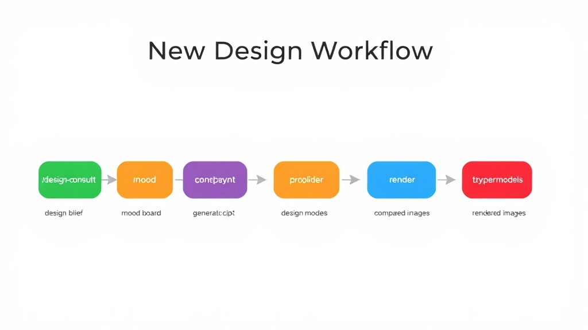
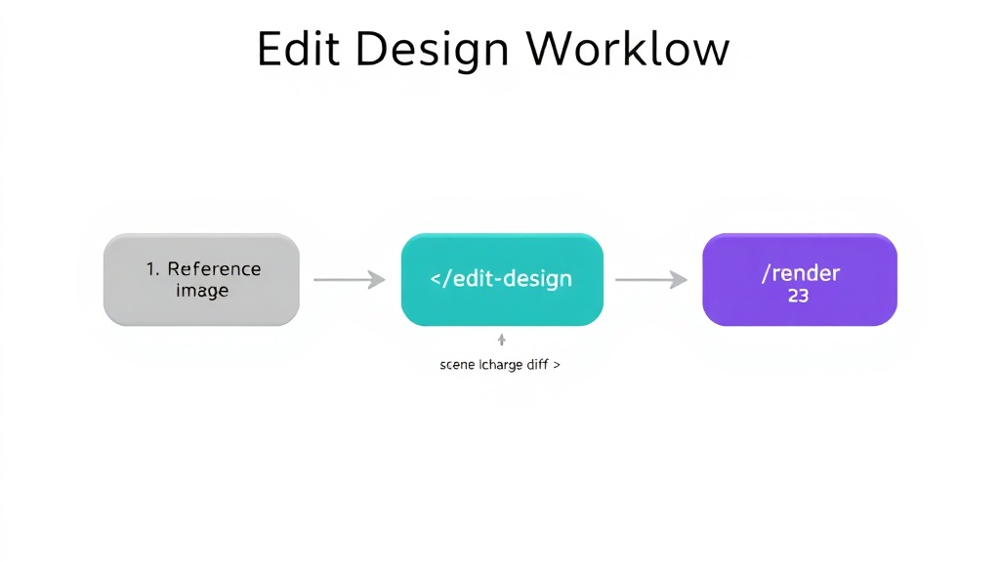
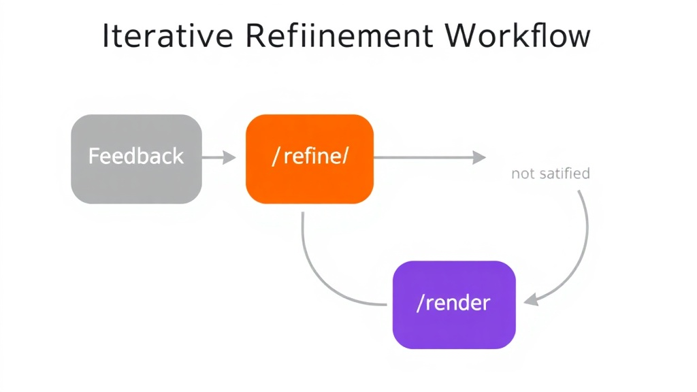

# pandaConcept

**An AI design framework where skills think together, not alone.**

pandaConcept doesn't just wrap AI image APIs with prompts. It implements a **Graph of Skills** — a network of interconnected design capabilities where each skill knows what came before it, what should come next, and what can go wrong along the way.

The result: an AI that reasons about interior design the way a human designer does — connecting consultation to mood boards to prompts to renders to refinement — automatically, not through rigid pipelines.

## Why a Graph of Skills?

Most AI tools are **flat**: a list of independent commands. You run one, get output, manually figure out what to do next.

pandaConcept skills are **connected**: each skill explicitly references related skills, describes when to use them, and warns about common pitfalls. This gives the AI agent a mental map of the entire design process.


### What makes this different

| Traditional AI tools | pandaConcept |
|---------------------|-------------|
| Skills are isolated commands | Skills mention and link to each other |
| User decides what to run next | AI suggests the natural next step |
| Errors are silent | Each skill has documented gotchas |
| One-shot generation | Iterative refinement with tracked history |
| Same prompt for all providers | Provider-optimized prompts from shared style data |

### How it works in practice

**You say:** "Design a Japandi living room"

**The framework reasons:**
1. No design brief exists → start with `/design-consult`
2. Consult outputs brief → brief mentions mood, so suggest `/mood-board`
3. Mood board captures atmosphere → convert to prompts via `/generate-prompt`
4. Generate provider-specific prompts (DALL-E wants short + explicit, Stability wants keywords + negative prompt, Midjourney wants flowing language)
5. Render across providers → `/render`
6. Multiple outputs exist → suggest `/compare-models`
7. User picks the best but wants warmer lighting → `/refine` with tracked diff
8. Still not right after 3 iterations? Refine's gotchas suggest: go back to `/generate-prompt` and rebuild, don't keep patching

**No manual orchestration.** The AI reads the skill graph and navigates it.

## The Three Workflows

### 1. New Design — from blank canvas to rendered image



The full pipeline: gather requirements → build concept → generate prompts → render → evaluate. Each step enriches the next.

### 2. Edit Design — surgical changes to existing images



Send a photo + describe changes. The system inventories every object, creates a KEEP/MODIFY/ADD/REMOVE diff, and generates prompts that preserve what works.

### 3. Iterative Refinement — converge on the perfect render



Systematic prompt improvement with tracked diffs. The framework knows when to refine, when to rebuild, and when to switch providers.

## Graph of Skills Architecture

Each skill in the graph contains three layers:

### 1. Core Logic
What the skill does — consultation, prompt generation, rendering, etc.

### 2. Session Relevant Skills
Explicit references to related skills with **context on when to use each one**:

```markdown
## Session Relevant Skills

- `/render` — the natural next step. Takes these prompts and sends them to providers.
- `/mood-board` — if the user came here without a mood board, prompts may lack depth.
  Suggest /mood-board first for ambiance-heavy styles (Wabi-Sabi, Bohemian).
- `/design-consult` — if requirements are unclear, redirect here rather than guessing.
```

This isn't just a list of links. Each reference explains the **relationship** — is it a prerequisite? A next step? An alternative? A fallback?

### 3. Gotchas
Domain-specific pitfalls that prevent wasted renders and API costs:

```markdown
## Gotchas

- Provider prompt lengths differ wildly: DALL-E 3 = under 400 chars.
  Stability = comma-separated keywords. Don't use one format for all.
- "All providers" means 6 API calls. Ask if they really want all.
- After 3+ refinement iterations with diminishing returns, rebuild the prompt
  from scratch via /generate-prompt rather than keep patching.
```

The AI reads these gotchas and **avoids the mistakes** before they happen.

## 30+ Design Styles

The framework's shared vocabulary — every skill references these styles for consistent, accurate design language.

**Modern & Contemporary** — Modern, Minimalist, Scandinavian, Contemporary, Japandi, Mid-Century Modern

**Classic & Traditional** — Neoclassical, Victorian, Art Deco, French Provincial, Baroque, Colonial

**Asian & Eastern** — Japanese (Wabi-Sabi), Chinese Traditional, Vietnamese, Indochine, Korean

**Regional & Vernacular** — Mediterranean, Tropical, Bohemian, Rustic, Farmhouse, Coastal

**Specialty & Avant-Garde** — Industrial, Brutalist, Biophilic, Maximalist, Retro, Futuristic

Each style: curated keywords, materials, color palettes with hex codes, and provider-specific prompt optimization.

## Supported Providers

| Provider | Model | Strengths |
|----------|-------|-----------|
| OpenAI | DALL-E 3 | Clean modern styles, consistent composition |
| Google Gemini | Imagen | Structured scenes, good color accuracy |
| Stability AI | SD3 | Texture-heavy styles, supports negative prompts + inpainting |
| Midjourney | v6 | Atmospheric/dramatic styles, artistic quality |
| xAI Grok | Grok 2 Image | Fast iteration, good general quality |
| Flux | Flux | Detailed photorealism |

Each provider gets **different prompts for the same design** — because DALL-E needs concise explicit instructions while Stability wants comma-separated keywords with negative prompts.

## Setup

**Requirements:** Python 3.11+, [Claude Code](https://claude.ai/code)

```bash
git clone https://github.com/nguyenvanduocit/pandaConcept.git
cd pandaConcept
pip install -e ".[dev]"

# Configure API keys (only for providers you want to use)
cp .env.example .env
```

```
GEMINI_API_KEY=...       # Google Gemini
OPENAI_API_KEY=...       # OpenAI (DALL-E 3)
GROK_API_KEY=...         # xAI Grok
STABILITY_API_KEY=...    # Stability AI
MIDJOURNEY_API_KEY=...   # Midjourney
FLUX_API_KEY=...         # Flux
```

## Usage

Open the project in Claude Code. The skill graph is automatically available through slash commands.

```bash
# Start a full design workflow
/design-consult

# Jump to any point in the graph
/generate-prompt
/edit-design
/style-guide

# The AI will suggest what comes next based on the skill graph
```

## Architecture

```
src/
├── providers/          # Pluggable AI provider adapters (BaseProvider interface)
├── styles/             # Data-driven design style catalog (DesignStyle dataclasses)
├── prompts/            # Prompt builder (style data + provider optimization)
├── consultation/       # Design consultation logic
└── utils/              # Shared utilities

.claude/skills/         # The skill graph — 8 interconnected skills
```

**Provider pattern:** Each provider implements `BaseProvider` — `generate()` for async rendering, `optimize_prompt()` for provider-specific format transformation.

**Style system:** `DesignStyle` dataclasses with structured fields (keywords, materials, colors, hex codes). The prompt builder pulls from these to construct style-accurate prompts.

## Development

```bash
pytest               # Run tests
ruff check src/      # Lint
ruff format src/     # Format
```

## License

MIT
