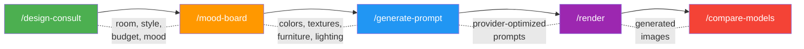
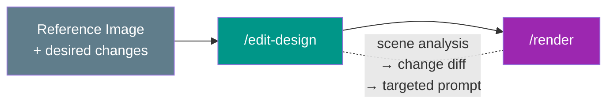
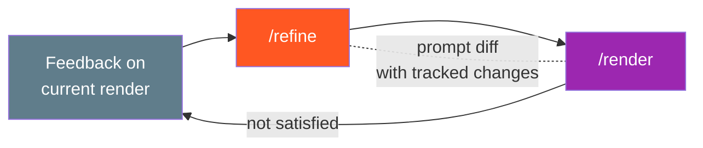
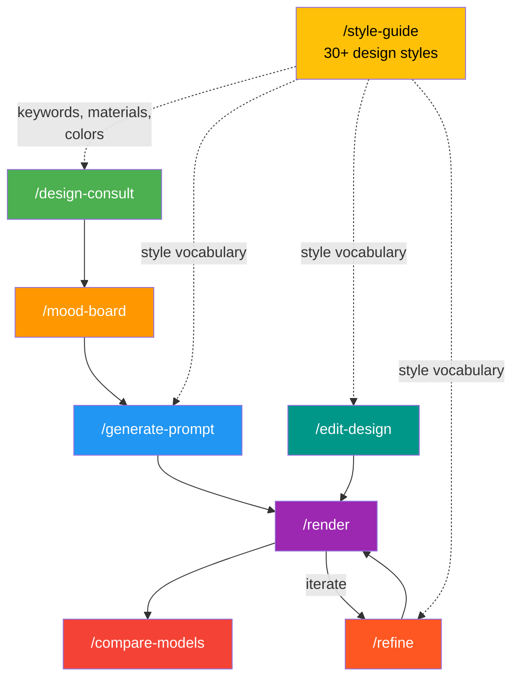

# pandaConcept

AI-powered interior design workflows. Generate optimized rendering prompts, send them to multiple AI image providers, and iterate on designs — all from your terminal via [Claude Code](https://claude.ai/code).

## What It Does

pandaConcept connects interior design knowledge (30+ styles, materials, color palettes) with AI image generation APIs. Instead of manually crafting prompts for each provider, you describe what you want and get provider-optimized prompts that produce better renders.

**Three workflows:**

### New Design (from scratch)

Start from a blank slate — define your vision, build a concept, generate prompts, render images, and compare results across providers.



1. **`/design-consult`** — Interactive consultation: gather room type, style preferences, budget, mood. Outputs a complete design brief with color palette, materials, furniture plan, and lighting.
2. **`/mood-board`** — Transform the brief into a rich mood board: color story, texture map, key furniture pieces, lighting atmosphere, and sensory experience description.
3. **`/generate-prompt`** — Convert the design concept into provider-optimized prompts. Each provider gets a tailored format — keyword-style for Stability AI, structured sections for Gemini, flowing language with parameters for Midjourney.
4. **`/render`** — Send prompts to AI provider APIs. Images saved to `output/[style]/[provider]/`. Handles errors, rate limits, and content filtering gracefully.
5. **`/compare-models`** — Side-by-side evaluation across providers on style accuracy, photorealism, composition, detail quality, and color fidelity. Recommends best provider per use case.

### Edit Existing Design (from reference image)

Already have an image you like but want changes? Send the reference photo with your desired modifications — the system preserves what works and only changes what you ask for.



1. **`/edit-design`** — Analyzes the reference image: inventories every object, surface, material, color, and lighting source. Then creates a change diff (KEEP / MODIFY / ADD / REMOVE) based on your request. Generates targeted prompts for both full re-renders and inpainting (where providers support it).

**Example:** Send a dark marble bathroom photo + "change to Japandi style, add plants." The system keeps the layout and camera angle, swaps marble for wood + plaster, shifts colors from dark to warm neutrals, and adds greenery descriptions.

### Iterative Refinement

Not satisfied with a render? Feed back what's wrong and get an improved prompt with tracked changes.



1. **`/refine`** — Takes the previous prompt + your feedback (too dark, wrong furniture style, not enough texture). Identifies weak areas in the prompt, generates a refined version with a visible diff, and tracks iteration history. Can suggest switching providers if the issue is provider-specific.

### How Skills Connect

All skills reference `/style-guide` for consistent design vocabulary. The three workflows converge at `/render` and can feed back into each other.



## Supported Providers

| Provider | Model | Negative Prompt | Edit/Inpaint |
|----------|-------|:-:|:-:|
| OpenAI | DALL-E 3 | - | DALL-E Edit API |
| Google Gemini | Imagen | - | - |
| Stability AI | Stable Diffusion 3 | Yes | Inpainting |
| Midjourney | v6 | - | - |
| xAI Grok | Grok 2 Image | - | - |
| Flux | Flux | - | - |

## Supported Design Styles

**Modern & Contemporary** — Modern, Minimalist, Scandinavian, Contemporary, Japandi, Mid-Century Modern

**Classic & Traditional** — Neoclassical, Victorian, Art Deco, French Provincial, Baroque, Colonial

**Asian & Eastern** — Japanese (Wabi-Sabi), Chinese Traditional, Vietnamese, Indochine, Korean

**Regional & Vernacular** — Mediterranean, Tropical, Bohemian, Rustic, Farmhouse, Coastal

**Specialty & Avant-Garde** — Industrial, Brutalist, Biophilic, Maximalist, Retro, Futuristic

Each style includes curated keywords, materials, color palettes with hex codes, and provider-specific prompt optimization.

## Setup

**Requirements:** Python 3.11+

```bash
# Clone
git clone https://github.com/nguyenvanduocit/pandaConcept.git
cd pandaConcept

# Install
pip install -e ".[dev]"

# Configure API keys
cp .env.example .env
# Edit .env with your API keys
```

You only need keys for the providers you plan to use. The system gracefully skips providers without keys.

### Environment Variables

```
GEMINI_API_KEY=...       # Google Gemini
OPENAI_API_KEY=...       # OpenAI (DALL-E 3)
GROK_API_KEY=...         # xAI Grok
STABILITY_API_KEY=...    # Stability AI
MIDJOURNEY_API_KEY=...   # Midjourney
FLUX_API_KEY=...         # Flux
```

## Usage

pandaConcept is used through Claude Code slash commands. Install [Claude Code](https://claude.ai/code), open this project, and use the slash commands described in the workflows above.

```bash
# Quick start: get a design consultation
/design-consult

# Or jump straight to prompt generation
/generate-prompt

# Edit an existing design from a reference image
/edit-design

# Look up any design style
/style-guide
```

## Architecture

```
src/
├── providers/          # AI provider adapters
│   ├── base.py         # BaseProvider interface + RenderResult dataclass
│   ├── registry.py     # Provider lookup and listing
│   ├── openai_provider.py
│   ├── gemini_provider.py
│   ├── grok_provider.py
│   ├── stability_provider.py
│   └── flux_provider.py
├── styles/
│   └── catalog.py      # 20+ DesignStyle definitions with keywords, materials, colors
├── prompts/
│   └── builder.py      # Combines style data + provider optimization into prompts
├── consultation/       # Design consultation logic
└── utils/              # Shared utilities
```

**Provider pattern:** Each provider implements `BaseProvider` with three methods:
- `name` — display name
- `generate()` — async image generation via API
- `optimize_prompt()` — transform a base prompt into provider-specific format

**Style system:** Styles are data-driven `DesignStyle` dataclasses with structured fields (keywords, materials, colors, hex codes). The prompt builder pulls from these to construct style-accurate prompts.

**Prompt builder:** `build_prompt()` composes a base prompt from room + style data, then runs it through each provider's `optimize_prompt()` to produce provider-specific versions.

## Development

```bash
# Run tests
pytest

# Lint
ruff check src/ tests/

# Format
ruff format src/ tests/
```

## License

MIT
