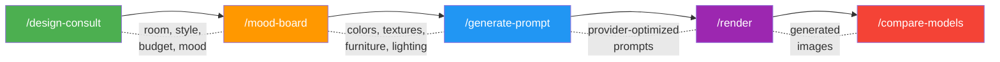
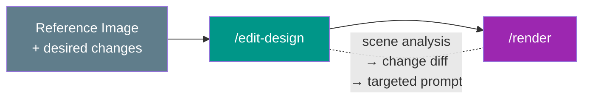
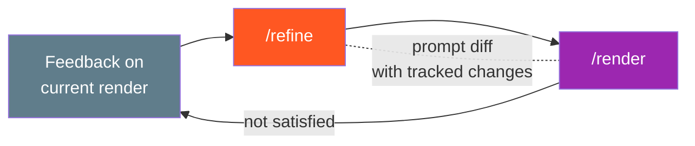
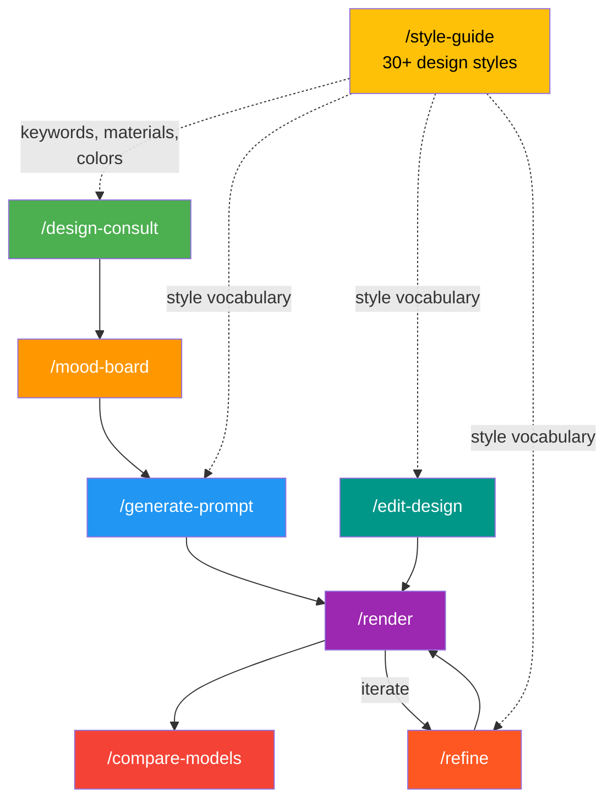

# pandaConcept

AI-powered interior design workflows. Generate optimized rendering prompts, send them to multiple AI image providers, and iterate on designs — all from your terminal via [Claude Code](https://claude.ai/code).

## What It Does

pandaConcept connects interior design knowledge (30+ styles, materials, color palettes) with AI image generation APIs. Instead of manually crafting prompts for each provider, you describe what you want and get provider-optimized prompts that produce better renders.

**Three workflows:**

### New Design (from scratch)



### Edit Existing Design (from reference image)



### Iterative Refinement



### How Skills Connect



## Supported Providers

| Provider | Model | Negative Prompt | Edit/Inpaint |
|----------|-------|:-:|:-:|
| OpenAI | DALL-E 3 | - | DALL-E Edit API |
| Google Gemini | Imagen | - | - |
| Stability AI | Stable Diffusion 3 | Yes | Inpainting |
| Midjourney | v6 | - | - |
| xAI Grok | Grok 2 Image | - | - |
| Flux | Flux | - | - |

## Supported Design Styles

**Modern & Contemporary** — Modern, Minimalist, Scandinavian, Contemporary, Japandi, Mid-Century Modern

**Classic & Traditional** — Neoclassical, Victorian, Art Deco, French Provincial, Baroque, Colonial

**Asian & Eastern** — Japanese (Wabi-Sabi), Chinese Traditional, Vietnamese, Indochine, Korean

**Regional & Vernacular** — Mediterranean, Tropical, Bohemian, Rustic, Farmhouse, Coastal

**Specialty & Avant-Garde** — Industrial, Brutalist, Biophilic, Maximalist, Retro, Futuristic

Each style includes curated keywords, materials, color palettes with hex codes, and provider-specific prompt optimization.

## Setup

**Requirements:** Python 3.11+

```bash
# Clone
git clone https://github.com/nguyenvanduocit/pandaConcept.git
cd pandaConcept

# Install
pip install -e ".[dev]"

# Configure API keys
cp .env.example .env
# Edit .env with your API keys
```

You only need keys for the providers you plan to use. The system gracefully skips providers without keys.

### Environment Variables

```
GEMINI_API_KEY=...       # Google Gemini
OPENAI_API_KEY=...       # OpenAI (DALL-E 3)
GROK_API_KEY=...         # xAI Grok
STABILITY_API_KEY=...    # Stability AI
MIDJOURNEY_API_KEY=...   # Midjourney
FLUX_API_KEY=...         # Flux
```

## Usage

pandaConcept is designed to be used through Claude Code slash commands. Each command is a skill that guides you through the process interactively.

### Workflow 1: Design from Scratch

Start with a consultation to define your design direction:

```
/design-consult
```

This walks you through room type, style preferences, budget, and mood — then outputs a design brief with color palette, materials, furniture, and lighting plan.

From there, generate a mood board to crystallize the concept:

```
/mood-board
```

Then create provider-optimized prompts:

```
/generate-prompt
```

You specify room type, style, and target provider. The system generates prompts tailored to each provider's strengths — keyword-style for Stability AI, structured descriptions for Gemini, flowing language with parameters for Midjourney.

Send prompts to providers:

```
/render
```

Compare outputs side-by-side:

```
/compare-models
```

### Workflow 2: Edit an Existing Design

Have a reference image you want to modify? Send it along with your changes:

```
/edit-design
```

The system analyzes the image (objects, surfaces, materials, colors, lighting, camera angle), creates a diff of what to keep vs. change, and generates targeted prompts. Supports both full re-renders and inpainting prompts for providers that support it.

**Example:** Send a photo of a dark marble bathroom and say "change to Japandi style, add plants." The system preserves the layout and camera angle while swapping materials (marble -> wood + plaster), colors (dark -> warm neutrals), and adding greenery.

### Workflow 3: Iterative Refinement

Not happy with a render? Refine it:

```
/refine
```

Provide the previous prompt and feedback (too dark, wrong furniture, not enough texture detail). The system identifies what's weak in the prompt, generates a refined version with tracked changes, and can suggest switching providers if the issue is provider-specific.

### Reference

```
/style-guide
```

Look up any of the 30+ design styles — keywords, materials, colors, and characteristics. Used by all other skills internally.

## Architecture

```
src/
├── providers/          # AI provider adapters
│   ├── base.py         # BaseProvider interface + RenderResult dataclass
│   ├── registry.py     # Provider lookup and listing
│   ├── openai_provider.py
│   ├── gemini_provider.py
│   ├── grok_provider.py
│   ├── stability_provider.py
│   └── flux_provider.py
├── styles/
│   └── catalog.py      # 20+ DesignStyle definitions with keywords, materials, colors
├── prompts/
│   └── builder.py      # Combines style data + provider optimization into prompts
├── consultation/       # Design consultation logic
└── utils/              # Shared utilities
```

**Provider pattern:** Each provider implements `BaseProvider` with three methods:
- `name` — display name
- `generate()` — async image generation via API
- `optimize_prompt()` — transform a base prompt into provider-specific format

**Style system:** Styles are data-driven `DesignStyle` dataclasses with structured fields (keywords, materials, colors, hex codes). The prompt builder pulls from these to construct style-accurate prompts.

**Prompt builder:** `build_prompt()` composes a base prompt from room + style data, then runs it through each provider's `optimize_prompt()` to produce provider-specific versions.

## Development

```bash
# Run tests
pytest

# Lint
ruff check src/ tests/

# Format
ruff format src/ tests/
```

## License

MIT
